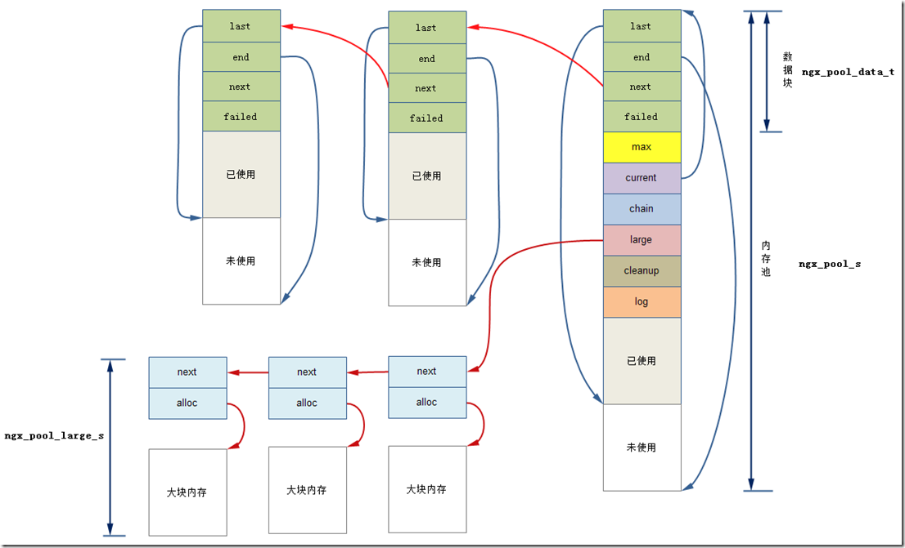

Nginx 内存池原理详见：
[Nginx 内存池](https://blog.csdn.net/ACMer_L/article/details/107867593)

内存池关系图：

 假设p为指向ngx_pool_s中的d的指针，则对于小块内存的分配，Nginx内存池策略如下：

若当前所需的内存size大于当前block剩余的内存，则我们返回last的指针作为分配的内存的首地址，并且将last指向last+size的位置。
若当前所需的小块内存size小于当前的p指向的ngx_pool_data_t的剩余的内存，则我们返回p中last的地址作为内存分配的首地址，并且调整p中的last为last + size。
若当前所需的小块内存size大于当前的p指向的ngx_pool_data_t的剩余的内存，则我们开辟一块新的ngx_pool_s结构体，并将当前d指针指向d->next，然后重复第一步的操作。
